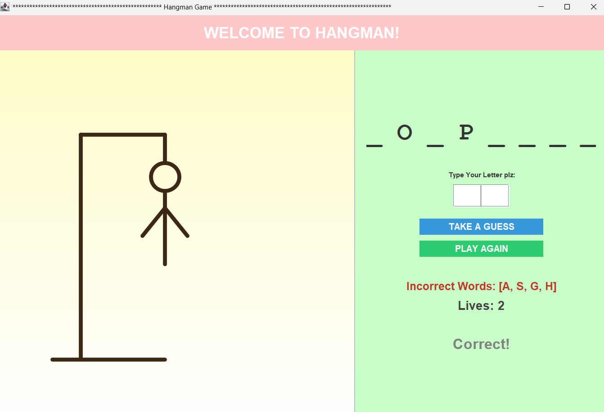

# hangman-game

The famous hangman game built by using Java

Graphical hangman game developed using java swing. Fill in the letters to the blank word as they are guessed, before the hangman is finished.



## Features

- Interactive display that shows a picture of the hangman that becomes more complete as each incorrect guess is made.
- Displays incorrect guesses made and life count down.
- Praise and criticism notes
- To play again, click the Play Again button.
- It has access to the few word banks and randomly it selects the choosen word

## How to run

1. Install JDK (Java 17 or higher)
2. Clone this repo
3. Compile and run:

```
javac Hangman.java
java Hangman

```

## What I learned

- Creating a GUI using Java Swing (frames, panels, buttons, text fields)
- Creating custom graphics using paintComponent()
- Explain how to handle events from action listeners. Handling events with action listeners
- Using an object oriented approach to design and manage the game state.